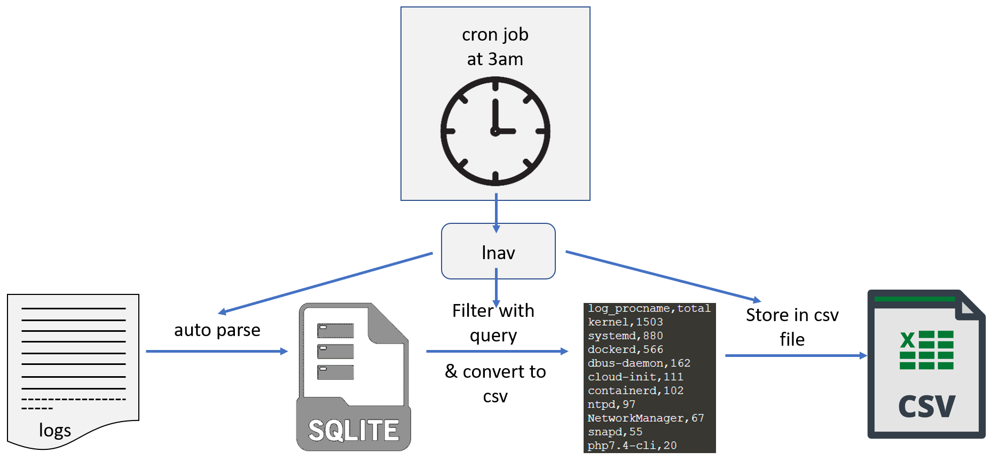

# View and parse your logs on ubuntu with lnav
## Transform your logs into a more manageable format, for analyzing or further processing
In this tutorial you will learn how to use lnav on ubuntu.   
You will learn:
- how to view your logs live
- how to filter through logs with SQLite queries
- how to store the results
- and finally how to automate that whole process with a cron job

## Motivation:
Logs can look a bit overwhelming, especially when the logs grow after a few months or years. 
When you want to investigate something, you usually open a log file and **ctrl + f** search, until you found what you needed. 
It would be nice to have that information at a first glance though. 
For that you would need to filter your logs and put that info somewhere, but how would you do that? 
lnav comes to the rescue. 
With lnav you can simply have a live look at your logs as they grow, and filter through them with a live edit to get to the needed info.
But, you can also automate that process, by creating a periodically running cron job, that does the filtering and stores the result in a file, nicely formatted.
That is exactly what you are going to learn in this tutorial.

## Workflow of the automation

## Background knowledge
**lnav**: the tool for parsing our logs 
**ubuntu**: the Operating System(OS) on which we install lnav 
**SQLite**: the query language with which we are filtering our log data 
**csv**: the data/file-format in which we will transform our data to (Microsoft Excel file format) 
**cron job**: an ubuntu functionality that runs assigned commands at a specified time 