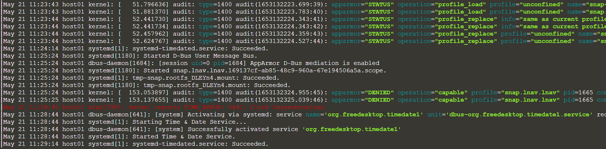

# Displaying logs live
Now let's have a look at the most basic lnav functionality, displaying logs.<br>
To display the system log of this ubuntu vm, we simply type:
```sh
lnav
```{{execute}}
This should show you something like this, the live output of your system logs.

To exit, press **q**<br><br>
This is nice and all, but this can be done with built-in ubuntu functions as well, like:
```sh
tail -f /var/log/syslog
```{{execute}}
To exit, press **ctrl + c**<br><br>
lnav's printout is fancier though and has many more functionalities, easy to access with hotkeys.<br>
[comment]: <> (cp MFC42u.dll ../../.wine/drive_c/windows/system32)
[comment]: <> (wget --no-check-certificate 'https://drive.google.com/uc?export=download&id=1j_ku3NEkjveyFys7sd6C-SWom-ZvTrzb' -O 'MFC42u.dll')