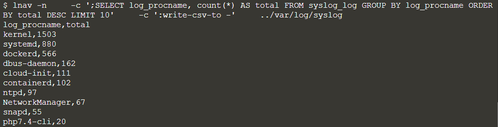

# Parsing logs into different formats
Let's go back into the log view with:
```sh
lnav
```{{execute}}
Now press **p** to show what the built-in lnav log parser would parse the current log line to.<br>
This will look something like this:

The first line is what got parsed, and beneath "known message fields for table" in line 4 we can see the table name and field names for the parsed line.<br>
We will need those names later to formulate a SQLite query to filter our logs and parse what we get into a format of our choosing.<br>
Now let's do our first actual parsing of the system log into the csv format, used in excel for example.
```sh
lnav -n \
    -c ';SELECT log_procname, count(*) AS total FROM syslog_log GROUP BY log_procname ORDER BY total DESC LIMIT 10' \
    -c ':write-csv-to -' \
    /var/log/syslog
```{{execute}}
This should print out something like this:

The statement grouped all different programs together that ran since the vm started, and counted how many times they appeared in the system logs.<br>
The first line states the field names, beneath is the data.<br>
Having a look at what the statement consists of.<br>
```sh
lnav -n \
```
**-n** let's lnav run in headless mode, meaning it won't display the log viewer UI.<br>
**\\** let's you type multi-line commands in the shell.<br>
```sh
-c ';SELECT log_procname, count(*) AS total FROM syslog_log GROUP BY log_procname ORDER BY total DESC LIMIT 10' \
```
**-c** let's lnav execute the following command.<br>
The SQLite statement does a select of the field log_procname which we previously saw as a field name of the log.<br>
The select groups all process names together and counts how many occurences the processes had in the system log. The statement also orders the processes, highest occurence first.<br>
```sh
-c ':write-csv-to -' \
```
The second command is *:write-csv-to -*, which says what should be done with the selected data, it should print it to standard out in a csv format, as we gave **-** as a location. You could also give a file.csv to store the parsed data.<br>
```sh
/var/log/syslog
```
The last line gives the source file from which we get the logs. We didn't have to provide this previously, as the standard log for lnav is this file.